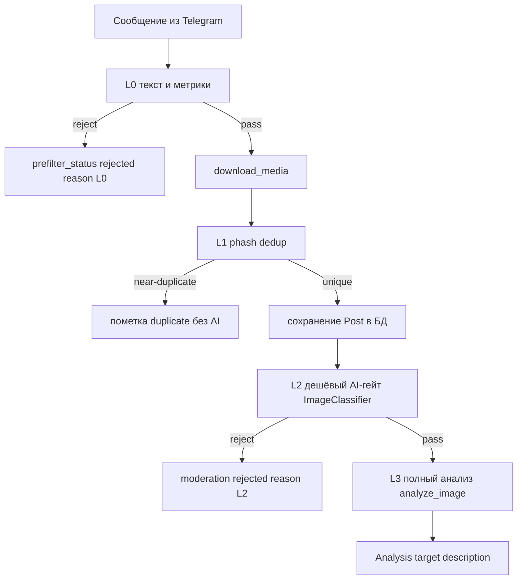
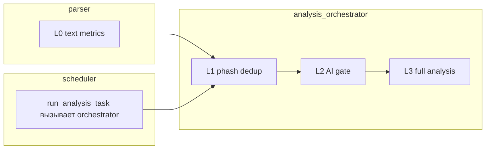

# План доработки: умная предфильтрация постов

## 1. Контекст и проблема

Сейчас в проекте **нет настоящей предфильтрации**. Поток выглядит так:

```
Telegram → парсер качает ВСЕ посты (text+photo) → phash → запись в БД
                                                          ↓
              ImageClassifier (Stage-1 AI-гейт) → evaluate() → полный анализ (Stage-2)
```

### Найденные проблемы (по коду)

| # | Проблема | Где |
|---|----------|-----|
| P1 | Парсер скачивает и хранит ВСЕ посты с text+photo, без отсева мусора до download | [`parser/telegram_parser.py`](../parser/telegram_parser.py:229) |
| P2 | AI-гейт (Stage-1) запускается поздно — на этапе полного анализа, тратя OpenAI-кредиты на classify + analyze для каждой картинки | [`ai/image_analysis.py`](../ai/image_analysis.py:273) |
| P3 | Планировщик ПОЛНОСТЬЮ обходит фильтр: [`_run_analysis_task()`](../scheduler/scheduler.py:63) вызывает сырой `analyze_image()` без `FilterConfig` и Stage-1 | [`scheduler/scheduler.py:96`](../scheduler/scheduler.py:96) |
| P4 | Настройки фильтра `ai_filter_*` читаются из БД, но **не имеют UI** | [`ai/image_classifier.py`](../ai/image_classifier.py:229) |
| P5 | Нет метрик отсева — непонятно, сколько постов и на каком этапе отсеяно | — |
| P6 | phash-дедуп считается, но только для citation; не используется как стадия предфильтра «не анализировать повтор» | [`ai/image_similarity.py`](../ai/image_similarity.py:94) |

## 2. Целевая архитектура — 4-уровневый пайплайн



**Принцип удешевления:** каждый следующий уровень дороже предыдущего, поэтому отсев происходит как можно раньше.

- **L0 (текст/метрики, бесплатно, ДО скачивания)** — стоп-слова, мин. длина текста, мин. просмотры/ER, язык, дата.
- **L1 (phash-дедуп, дёшево, после скачивания)** — если картинка near-duplicate уже проанализированной → не гонять через AI повторно.
- **L2 (дешёвый AI-гейт, gpt-4o-mini classify)** — текущий `ImageClassifier` + `evaluate()`, но как обязательная отдельная стадия.
- **L3 (полный анализ, дорогой)** — текущий `analyze_image()` + target description, только для прошедших L0–L2.

## 3. Изменения по компонентам

### 3.1. Конфигурация фильтра (`ai/prefilter.py` — новый модуль)
Единый источник настроек и логики предфильтра. Перенести/расширить `FilterConfig`.
**Решение по дефолтам (согласовано):** задаём разумные значения сразу, каждое — редактируемое поле в UI.

| Ключ | Уровень | Дефолт | Назначение |
|------|---------|--------|------------|
| `prefilter_enabled` | — | `true` | глобальный вкл/выкл |
| `prefilter_min_text_len` | L0 | `30` | мин. длина текста поста (символы) |
| `prefilter_stopwords` | L0 | `розыгрыш, конкурс, подпишись, erid, вакансия, ищем сотрудника` | стоп-слова через запятую, правится в UI |
| `prefilter_min_views` | L0 | `0` | мин. просмотры (0 = выкл) |
| `prefilter_min_er` | L0 | `0` | мин. ER % (0 = выкл) |
| `prefilter_languages` | L0 | `ru, en` | разрешённые языки (пусто = любые) |
| `prefilter_dedupe_enabled` | L1 | `true` | сворачивать дубли |
| `prefilter_dedupe_threshold` | L1 | `10` | порог Hamming-дистанции phash |
| `ai_filter_enabled` | L2 | `true` | существующий AI-гейт |
| `ai_min_solo_appeal` | L2 | `4.0` | существующий порог |
| `ai_reject_text_screenshots` | L2 | `true` | существующий |
| `ai_reject_news_photos` | L2 | `true` | существующий |
| `ai_reject_unethical` | L2 | `true` | существующий |

Функции: `PrefilterConfig.from_settings()`, `evaluate_text_metrics(post_meta) -> Decision`, `evaluate_dedupe(...) -> Decision`.

### 3.2. Парсер ([`parser/telegram_parser.py`](../parser/telegram_parser.py:1))
- Перед `download_media` (строка ~233) применить L0 на `message.text` + метрики (`views`, `er` можно прикинуть до скачивания).
- Отклонённые на L0 — НЕ скачивать `download_media`; создаём лёгкую запись `Post` с `prefilter_status='rejected'`, `prefilter_stage='L0'`, без `Image` (для аналитики воронки; см. §5).
- Инкрементировать счётчики воронки (passed_L0 / rejected_L0).

### 3.3. phash-дедуп как стадия L1 ([`ai/image_similarity.py`](../ai/image_similarity.py:1))
- Добавить функцию `find_duplicate_group_leader(session, image_hash, threshold)` — ищет похожий пост (near-duplicate) и определяет «лидера группы» — самый популярный пост по `engagement`/`er`.
- **Решение по дублям (согласовано):** дубли **сворачиваются внутрь самого популярного поста группы**. Менее популярные помечаются `prefilter_status='duplicate'` + ссылка на лидера; в ленте показывается только лидер с `duplicate_count`.
- Если приходит новый дубль популярнее текущего лидера — лидерство переходит к нему (пересчёт группы).
- Переиспользуем существующую механику фронта «🧬 Скрывать дубли» и поле `duplicate_count` ([`web/static/app.js`](../web/static/app.js:618)).
- Near-duplicate не гоняется через L2/L3 повторно — экономия OpenAI.

### 3.4. Единый пайплайн анализа ([`ai/image_analysis.py`](../ai/image_analysis.py:244))
- Вынести логику L1→L2→L3 в одну функцию-оркестратор, которую вызывают и ручной запуск, и планировщик.
- Сохранять причину отсева на каждом уровне.

### 3.5. Планировщик ([`scheduler/scheduler.py`](../scheduler/scheduler.py:63)) — критический фикс
- Заменить тело [`_run_analysis_task()`](../scheduler/scheduler.py:63) на вызов того же оркестратора (с L2-гейтом и `PrefilterConfig`), что и ручной режим, чтобы убрать расхождение P3.

### 3.6. Схема БД ([`db/models.py`](../db/models.py:1) + [`db/migrations.py`](../db/migrations.py:1))
- `Post`: добавить `prefilter_status` (VARCHAR, default 'pending'), `prefilter_reason` (VARCHAR), `prefilter_stage` (VARCHAR: L0/L1/L2/passed).
- `ScheduleLog`: добавить счётчики воронки — `rejected_l0`, `rejected_l1`, `rejected_l2`, `passed_full` (INTEGER default 0).
- Идемпотентные `ALTER TABLE ... ADD COLUMN IF NOT EXISTS` в стиле существующих миграций.

### 3.7. API ([`api/server.py`](../api/server.py:1))
- `GET/POST /api/prefilter-settings` — по аналогии с [`/api/channel-filters`](../api/server.py:2025).
- `GET /api/prefilter-stats` — воронка отсева (агрегаты по `prefilter_stage` + последние запуски из `ScheduleLog`).

### 3.8. UI ([`web/templates/index.html`](../web/templates/index.html:1) + [`web/static/app.js`](../web/static/app.js:1))
- Новая вкладка настроек «Предфильтр» рядом с «Фильтры каналов» (строка ~698).
- Блок метрик-воронки на дашборде: сколько постов отсеяно на L0/L1/L2 и сколько дошло до полного анализа.

### 3.9. Документация ([`README.md`](../README.md:32))
- Описать 4-уровневый пайплайн, настройки и метрики в разделе «Что умеет проект».

## 4. Mermaid: где живут стадии



## 5. Решения по открытым вопросам

1. ✅ **L1 near-duplicate (согласовано):** дубли сворачиваются внутрь самого популярного поста группы; в ленте виден только лидер с `duplicate_count`.
2. ✅ **Стоп-слова и пороги (согласовано):** задаём разумные дефолты сразу (см. таблицу в §3.1), каждый параметр — редактируемое поле в UI.
3. ⏳ **Судьба отсеянных на L0 постов (на согласование):** не сохранять в БД вообще ИЛИ хранить лёгкую запись `prefilter_status='rejected'` ради аналитики воронки. По умолчанию принимаю — хранить лёгкую запись без скачивания картинки.
4. ⏳ **Backfill (на согласование):** прогонять ли уже накопленные посты через новый предфильтр. По умолчанию принимаю — да, отдельной idempotent-командой по аналогии с `backfill_hashes`.

## 6. Порядок реализации (для режима Code)

1. БД-миграции + модели (фундамент).
2. `ai/prefilter.py` (конфиг + L0/L1 логика).
3. Интеграция L0 в парсер.
4. Оркестратор L1→L2→L3 в `image_analysis.py`.
5. Фикс планировщика.
6. Метрики воронки + API.
7. UI (настройки + метрики).
8. README + тесты/backfill.
